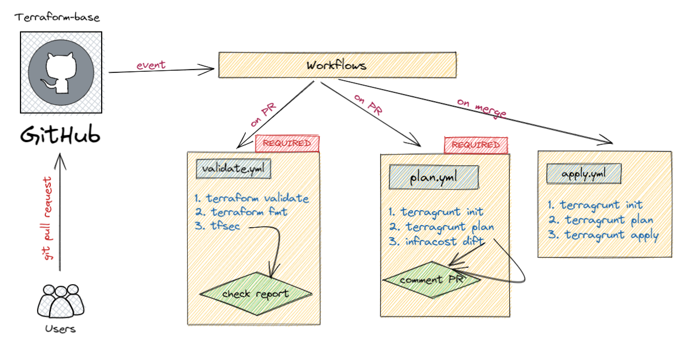
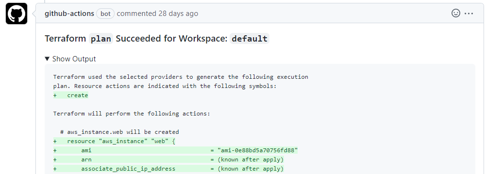
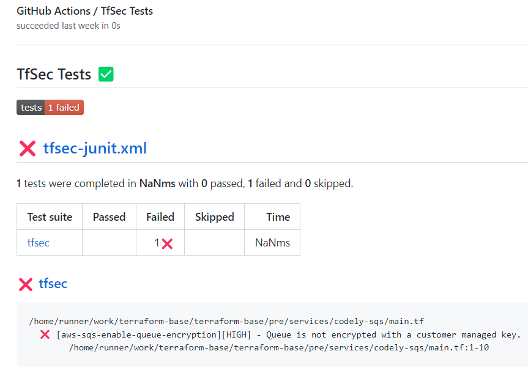
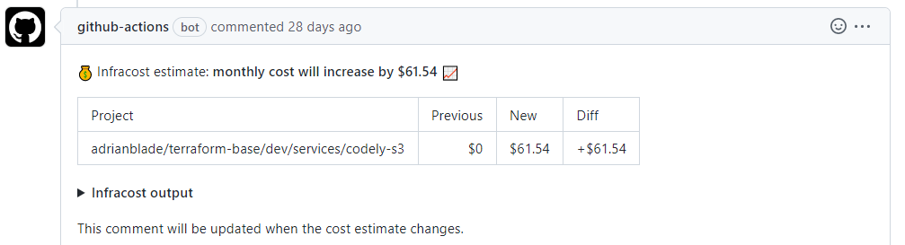

<h1 align="center">
  🪐 Terraform CI/CD - terragrunt - tfsec - infracost
</h1>

This repository contains a basic Terraform CI/CD. Designed to store all the IaC code on a mono-repo with high tfstate granularity. Supports multi-account and regions.

## Requirements

- Terraform v.1.2.0+
- Terragrunt v0.38.0+
- Tfenv
- AWS account (free tier)
## GitHub actions - Workflows

## Screenshots

